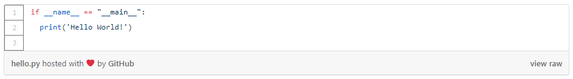

# GitHub Widgets for WordPress
**Author: [James Barnden](https://github.com/JBarnden)**

## Description
A lightweight GitHub widgets plugin for your blog. Includes shortcode for embedding GitHub hosted Gists/files and buttons for:

- Follow
- Watch
- Star
- Fork
- Download
- Issue

The plugin implements [ntkme's 'github-buttons'](https://github.com/ntkme/github-buttons) and [Robert Krimen's gist-it](https://gist-it.appspot.com/) as shortcodes.

## Installation
- Copy the `wp-github-widgets` directory to your plugins folder `wp-content/plugins`.
- Activate the plugin via the plugins interface.

## Usage

### GitHub Follow Button
Add the `[Github_User_Button user='JBarnden']` shortcode in your content and replace `JBarnden` with the desired GitHub username.

#### Optional Additional Parameters
- `size`: makes the button slightly bigger, can be set to `large` or `small`.  Default value is `small`.
- `show_count`: show current number of followers, can be set to `true` or `false`.  Default value is false.

#### Example
`[Github_User_Button user='JBarnden' size='large' show_count='true']`

#### Screenshot

### GitHub Repo Buttons
Add the `[Github_Repo_Button user='JBarnden' repo='MyRepo']` shortcode in your content, replacing `JBarnden` with the desired GitHub username and `MyRepo` with the desired repo belonging to the specified user.

#### Optional Additional Parameters
- `type`: changes button behaviour/type, can be set to `watch`, `star`, `fork`, `issue` or `download`.  Default value is `star`.
- `size`: makes the button slightly bigger, can be set to `large` or `small`.  Default value is `small`.
- `show_count`: show current number of followers, can be set to `true` or `false`.  Default value is false.
- `icon`: can be used to set the icon to standard GitHub icon, can be set to `standard` or `type_default`. Default value is `type_default`.

#### Example
`[Github_Repo_Button user='JBarnden' repo='wp-github-widgets' size='large' show_count='true']`

### Display GitHub Gist
Add the `[Gist]gist_id[/Gist]` where `gist_id` is replaced with the id of the desired Gist.

#### Example
`[Gist]cee89b8a3600c50b7e50fa4870403069[/Gist]`

#### Screenshot

## Feature Requests and Contributions
Please submit feature requests and contributions via the issues section of the Repository.  If you feel like improving the plugin, pull requests are both welcome and appreciated.
